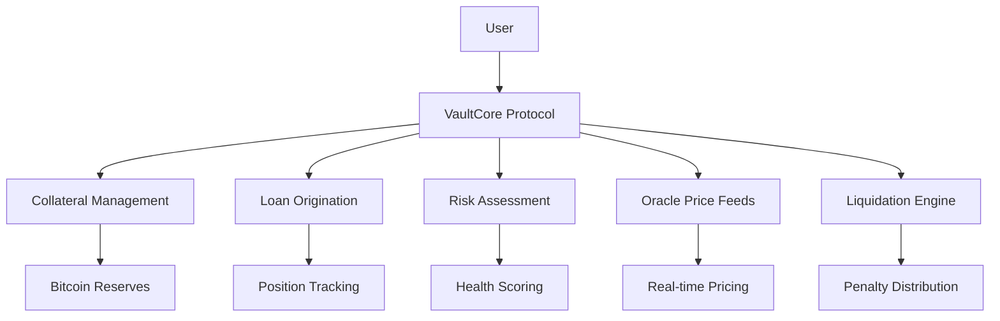

# VaultCore Protocol


[](https://stacks.co)
[](https://clarity-lang.org)
[](LICENSE)

> **Next-Generation Bitcoin Treasury Management on Stacks**

VaultCore is an institutional-grade Bitcoin collateralization platform that revolutionizes digital asset management. Built on Stacks Layer 2 infrastructure, it enables institutions and sophisticated investors to unlock Bitcoin's liquidity potential while maintaining custody and earning yield on their digital treasury reserves.

## 🚀 Key Features

### 🛡️ Security First

- **Zero-knowledge proof validation** for enhanced privacy
- **Time-locked transactions** for additional security layers
- **Decentralized governance** ensuring protocol integrity
- **Military-grade security protocols** for institutional compliance

### 📊 Advanced Risk Management

- **Dynamic risk assessment** with real-time collateral monitoring
- **Multi-tier liquidation protection** with grace period mechanisms
- **Algorithmic interest rate optimization** based on market conditions
- **Smart liquidation system** with penalty distribution

### 🏦 Enterprise Features

- **Institutional compliance framework** with full audit trail transparency
- **Cross-chain interoperability** for maximum capital efficiency
- **Multi-asset support** (BTC, STX, USDC)
- **Comprehensive portfolio management** with health scoring

## 📋 Table of Contents

- [Architecture Overview](#architecture-overview)
- [Installation & Setup](#installation--setup)
- [Core Functions](#core-functions)
- [Usage Examples](#usage-examples)
- [Security Features](#security-features)
- [API Reference](#api-reference)
- [Testing](#testing)
- [Contributing](#contributing)
- [License](#license)

## 🏗️ Architecture Overview



### Core Components

1. **Vault Position Management**: Comprehensive tracking of collateralized positions
2. **Dynamic Risk Engine**: Real-time assessment and health scoring
3. **Oracle Integration**: Multi-asset price feeds with volatility indexing
4. **Liquidation Protection**: Grace periods and automated liquidation execution
5. **Portfolio Analytics**: User-centric dashboard and performance metrics

## 🛠️ Installation & Setup

### Prerequisites

- [Clarinet](https://github.com/hirosystems/clarinet) >= 1.0.0
- [Node.js](https://nodejs.org/) >= 16.0.0
- [Stacks CLI](https://docs.stacks.co/build-apps/references/stacks-cli) (optional)

### Quick Start

1. **Clone the repository**

   ```bash
   git clone https://github.com/chidomere-ndubuisi/vault-core.git
   cd vault-core
   ```

2. **Install dependencies**

   ```bash
   npm install
   ```

3. **Verify contract syntax**

   ```bash
   clarinet check
   ```

4. **Run tests**

   ```bash
   npm test
   ```

5. **Deploy to testnet**

   ```bash
   clarinet integrate
   ```

## 🔧 Core Functions

### Initialization

```clarity
;; Initialize the protocol (Owner only)
(initialize-vaultcore-protocol)
```

### Collateral Management

```clarity
;; Deposit Bitcoin collateral
(deposit-bitcoin-collateral deposit-amount enable-protection)

;; Parameters:
;; - deposit-amount: Amount of Bitcoin to deposit (in satoshis)
;; - enable-protection: Boolean for liquidation protection
```

### Position Creation

```clarity
;; Create a new vault position
(originate-vault-position collateral-amount requested-loan-amount preferred-term-months)

;; Parameters:
;; - collateral-amount: Bitcoin collateral amount
;; - requested-loan-amount: Desired loan amount
;; - preferred-term-months: Loan term (max 36 months)
```

### Position Settlement

```clarity
;; Settle/repay a vault position
(settle-vault-position position-id repayment-amount)

;; Parameters:
;; - position-id: Unique position identifier
;; - repayment-amount: Amount to repay (principal + interest)
```

## 💡 Usage Examples

### Creating Your First Position

```clarity
;; 1. Initialize protocol (if not already done)
(contract-call? .vault-core initialize-vaultcore-protocol)

;; 2. Deposit collateral (1 BTC = 100,000,000 satoshis)
(contract-call? .vault-core deposit-bitcoin-collateral u100000000 true)

;; 3. Create position (175% collateralization ratio)
(contract-call? .vault-core originate-vault-position 
  u100000000    ;; 1 BTC collateral
  u2571428      ;; ~$25,714 loan (at $45k BTC price)
  u12)          ;; 12-month term

;; 4. Check position details
(contract-call? .vault-core get-vault-position-details u1)
```

### Portfolio Management

```clarity
;; Get user portfolio summary
(contract-call? .vault-core get-user-portfolio-summary 'SP1HTBVD3JG9C05J7HBJTHGR0GGW7KX975CN5QKB)

;; Get protocol performance metrics
(contract-call? .vault-core get-protocol-performance-metrics)

;; Check asset price data
(contract-call? .vault-core get-asset-price-data "BTC")
```

## 🔒 Security Features

### Access Control

- **Owner-only functions** for critical protocol operations
- **Position ownership verification** for all user actions
- **Emergency pause mechanism** for market volatility protection

### Risk Management

- **Minimum collateralization ratio**: 175%
- **Liquidation threshold**: 130%
- **Maximum positions per user**: 25
- **Dynamic volatility adjustments**

### Validation Systems

- **Input sanitization** for all parameters
- **Oracle price feed validation**
- **Position health monitoring**
- **Asset type verification**

## 📚 API Reference

### Read-Only Functions

| Function | Description | Parameters | Returns |
|----------|-------------|------------|---------|
| `get-vault-position-details` | Get comprehensive position info | `position-id: uint` | Position data with health metrics |
| `get-user-portfolio-summary` | User portfolio dashboard | `account: principal` | Portfolio summary and statistics |
| `get-protocol-performance-metrics` | Protocol-wide metrics | None | TVL, utilization, revenue data |
| `get-asset-price-data` | Oracle price information | `asset-symbol: string-ascii` | Price and volatility data |
| `get-protocol-health-status` | System health check | None | Protocol status indicators |

### State-Changing Functions

| Function | Description | Access Level | Key Parameters |
|----------|-------------|--------------|----------------|
| `initialize-vaultcore-protocol` | Initialize protocol | Owner | None |
| `deposit-bitcoin-collateral` | Deposit collateral | Public | `amount`, `protection` |
| `originate-vault-position` | Create new position | Public | `collateral`, `loan`, `term` |
| `settle-vault-position` | Repay position | Position Owner | `position-id`, `amount` |
| `adjust-collateral-requirements` | Update ratios | Owner | `min-ratio`, `liq-ratio` |
| `update-asset-price-oracle` | Update prices | Owner | `asset`, `price`, `volatility` |

### Error Codes

| Code | Constant | Description |
|------|----------|-------------|
| 1000 | `ERR_UNAUTHORIZED_ACCESS` | Insufficient permissions |
| 1001 | `ERR_INSUFFICIENT_COLLATERAL_COVERAGE` | Below minimum collateral ratio |
| 1002 | `ERR_BELOW_MINIMUM_THRESHOLD` | Parameter below required minimum |
| 1003 | `ERR_INVALID_TRANSACTION_AMOUNT` | Invalid amount specified |
| 1004 | `ERR_PROTOCOL_ALREADY_ACTIVE` | Protocol already initialized |
| 1005 | `ERR_PROTOCOL_NOT_INITIALIZED` | Protocol not yet initialized |
| 1006 | `ERR_LIQUIDATION_CONDITIONS_NOT_MET` | Liquidation conditions not satisfied |
| 1007 | `ERR_VAULT_POSITION_NOT_FOUND` | Position does not exist |
| 1008 | `ERR_VAULT_POSITION_INACTIVE` | Position is not active |
| 1009 | `ERR_INVALID_POSITION_IDENTIFIER` | Invalid position ID |
| 1010 | `ERR_ORACLE_PRICE_FEED_ERROR` | Oracle data unavailable |
| 1011 | `ERR_UNSUPPORTED_ASSET_TYPE` | Asset not supported |
| 1012 | `ERR_MARKET_VOLATILITY_PROTECTION` | Emergency pause active |

## 🧪 Testing

### Run Test Suite

```bash
# Run all tests
npm test

# Run with coverage
npm run test:coverage

# Run specific test file
npx vitest tests/vault-core.test.ts
```

### Test Coverage Areas

- ✅ Protocol initialization and configuration
- ✅ Collateral deposit and withdrawal flows
- ✅ Position creation and management
- ✅ Interest calculation and compounding
- ✅ Liquidation mechanics and protection
- ✅ Risk assessment algorithms
- ✅ Oracle integration and price feeds
- ✅ Error handling and edge cases
- ✅ Access control and permissions

### Example Test Structure

```typescript
import { describe, it, expect, beforeEach } from 'vitest';
import { Cl } from '@stacks/transactions';

describe('VaultCore Protocol Tests', () => {
  beforeEach(async () => {
    // Setup test environment
  });

  it('should initialize protocol successfully', () => {
    // Test protocol initialization
  });

  it('should create vault position with proper collateralization', () => {
    // Test position creation
  });

  it('should calculate interest correctly', () => {
    // Test interest calculations
  });
});
```

## 📈 Performance Metrics

### Protocol Statistics

- **Total Value Locked (TVL)**: Dynamic calculation based on collateral deposits
- **Utilization Rate**: Percentage of deposited collateral actively borrowed against
- **Revenue Generation**: Accumulated protocol fees and liquidation penalties
- **Position Health**: Real-time monitoring of all active positions

### Gas Optimization

- **Efficient data structures** for minimal storage costs
- **Batched operations** where applicable
- **Optimized calculation functions** for complex financial operations

## 🤝 Contributing

We welcome contributions from the community! Please read our [Contributing Guidelines](CONTRIBUTING.md) before submitting PRs.

### Development Workflow

1. **Fork** the repository
2. **Create** a feature branch (`git checkout -b feature/amazing-feature`)
3. **Commit** your changes (`git commit -m 'Add amazing feature'`)
4. **Push** to the branch (`git push origin feature/amazing-feature`)
5. **Open** a Pull Request

### Code Standards

- Follow [Clarity best practices](https://book.clarity-lang.org/)
- Maintain 100% test coverage for new features
- Document all public functions
- Use descriptive variable and function names

## 🛣️ Roadmap

### Version 2.2.0 (Q4 2025)

- [ ] Multi-signature wallet integration
- [ ] Advanced yield farming strategies
- [ ] Layer 2 scaling optimizations
- [ ] Enhanced oracle redundancy

### Version 3.0.0 (Q1 2026)

- [ ] Cross-chain Bitcoin bridge integration
- [ ] Institutional KYC/AML framework
- [ ] Advanced derivatives trading
- [ ] DAO governance implementation

## 📄 License

This project is licensed under the MIT License - see the [LICENSE](LICENSE) file for details.
